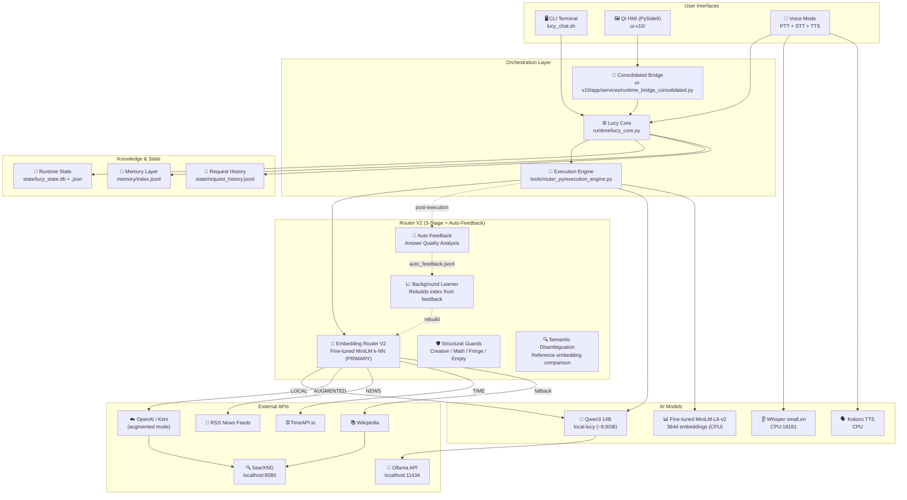
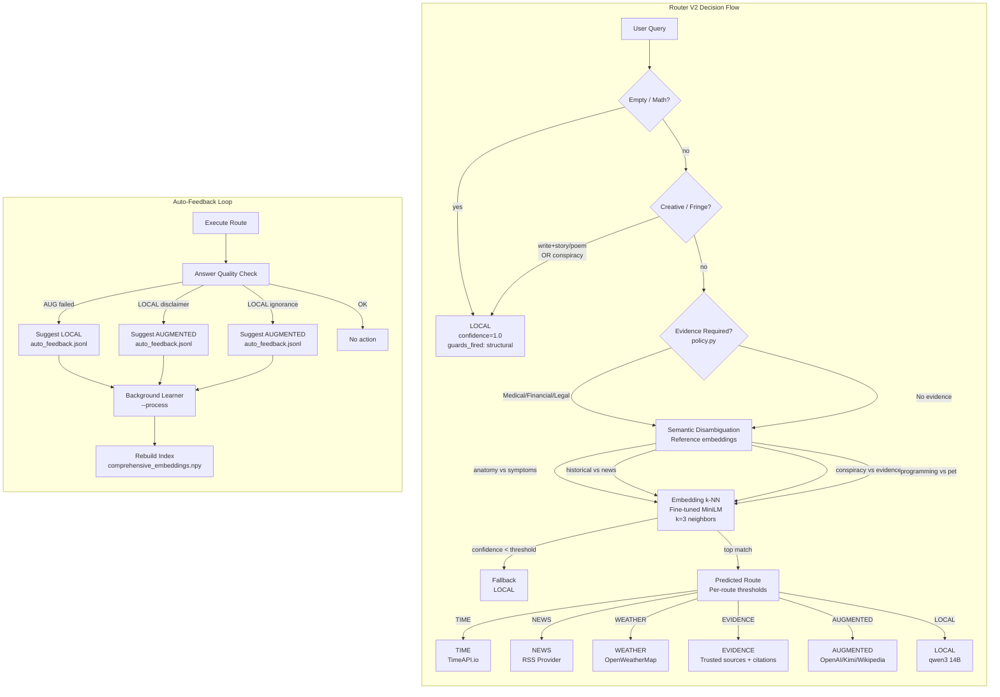
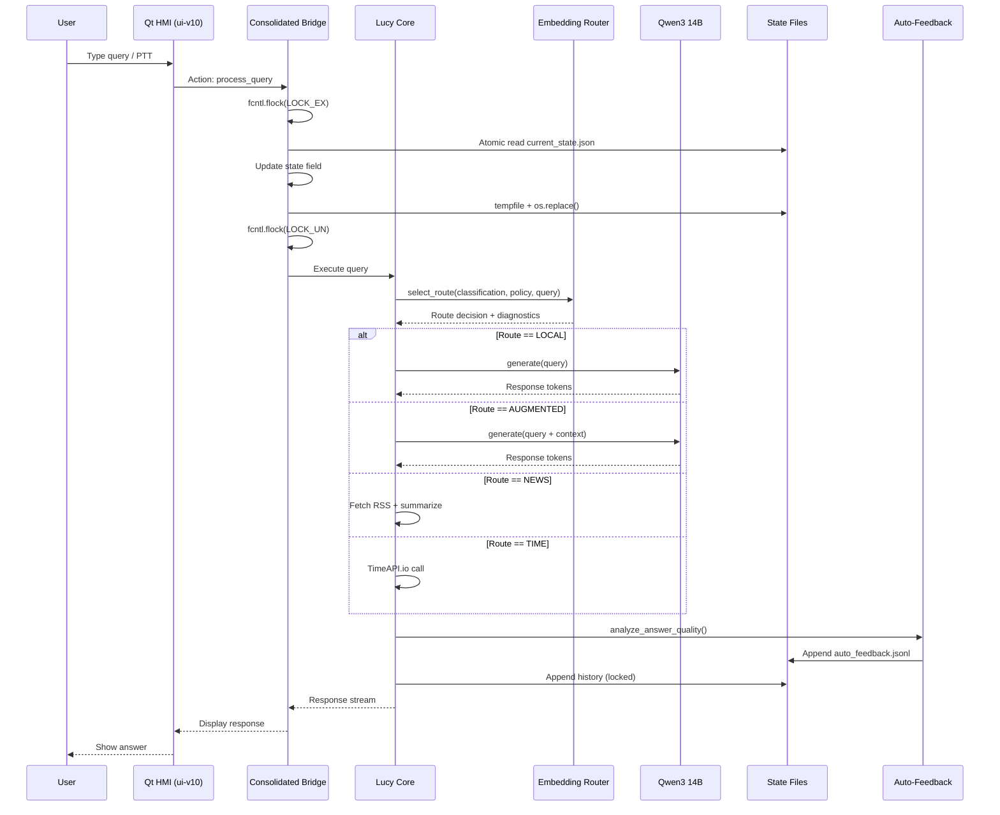

# Local Lucy V9 — Complete System Architecture

**Generated:** 2026-05-26  
**Version:** v9-stable-router-v2  
**Hardware:** RTX 3060 12GB, 31GB RAM, CPU+GPU hybrid  
**Test Suite:** 1,566 passed, 19 skipped, 17 pre-existing (model non-determinism)  
**Router:** HybridRouterV2 (MiniLM embedding k-NN + semantic disambiguation)  
**Philosophy:** *Correct answer > locality. The end justifies the means.*

---

## Mermaid: High-Level System Diagram



---

## ASCII: Component-Level Architecture

```
┌─────────────────────────────────────────────────────────────────────────────────────────┐
│                                    USER INTERFACES                                       │
│  ┌──────────────┐  ┌──────────────────────────────┐  ┌────────────────────────────────┐ │
│  │  CLI Shell   │  │     Qt HMI (PySide6)         │  │       Voice Mode (PTT)         │ │
│  │ lucy_chat.sh │  │  ui-v10/app/ui/main_window.py │  │  Press-to-Talk + STT + TTS     │ │
│  └──────┬───────┘  └──────────────┬───────────────┘  └───────────────┬────────────────┘ │
└─────────┼─────────────────────────┼────────────────────────────────────┼──────────────────┘
          │                         │                                    │
          │    ┌────────────────────┴────────────────────────────────────┘
          │    │
          ▼    ▼
┌─────────────────────────────────────────────────────────────────────────────────────────┐
│                                   ORCHESTRATION LAYER                                    │
│                                                                                          │
│  ┌─────────────────────────────────────────────────────────────────────────────────────┐ │
│  │                         CONSOLIDATED HMI BRIDGE                                      │ │
│  │   ui-v10/app/services/runtime_bridge_consolidated.py                                   │ │
│  │   • Atomic state writes (fcntl + tempfile + os.replace)                              │ │
│  │   • Voice PTT state machine                                                          │ │
│  │   • Model selector / augmented controls                                              │ │
│  │   • Status panel counters                                                            │ │
│  └────────────────────────────────┬────────────────────────────────────────────────────┘ │
│                                   │                                                      │
│                                   ▼                                                      │
│  ┌─────────────────────────────────────────────────────────────────────────────────────┐ │
│  │                              LUCY CORE ENGINE                                        │ │
│  │                         runtime/lucy_core.py                                          │ │
│  │   • Query ingestion & sanitization                                                   │ │
│  │   • Route dispatch (embedding primary / legacy rollback)                             │ │
│  │   • Response streaming & formatting                                                  │ │
│  │   • Token budget enforcement (chat:256, brief:128, detail:768, augmented:128)       │ │
│  └────────────────────────────────┬────────────────────────────────────────────────────┘ │
│                                   │                                                      │
│                                   ▼                                                      │
│  ┌─────────────────────────────────────────────────────────────────────────────────────┐ │
│  │                           EXECUTION ENGINE                                           │ │
│  │                      tools/router_py/execution_engine.py                              │ │
│  │   • Tool discovery & loading                                                         │ │
│  │   • Python/shell execution path selection                                            │ │
│  │   • Concurrency management                                                           │ │
│  │   • Result caching                                                                   │ │
│  │   • Auto-feedback: answer quality analysis post-execution                            │ │
│  └────────────────────────────────┬────────────────────────────────────────────────────┘ │
└───────────────────────────────────┼──────────────────────────────────────────────────────┘
                                    │
                                    ▼
┌─────────────────────────────────────────────────────────────────────────────────────────┐
│                         ROUTER LAYER (Single-Path + Auto-Feedback)                       │
│                                                                                          │
│   ┌─────────────────────────────────────────────────────────────────────────────────┐   │
│   │  EMBEDDING ROUTER (PRIMARY)                                                      │   │
│   │  models/router/hybrid_router.py  +  tools/router_py/classify.py                  │   │
│   │                                                                                  │   │
│   │  Stage 0: Creative Guard    Stage 1: Keyword Evidence    Stage 2: Embedding k-NN │   │
│   │  ┌──────────────┐           ┌──────────────┐            ┌──────────────┐         │   │
│   │  │ Write+Story  │           │ Medical      │            │ ModernBERT   │         │   │
│   │  │ → LOCAL      │           │ Financial    │───────────▶│ [CLS] token  │         │   │
│   │  │              │           │ Legal        │            │ + cosine sim │         │   │
│   │  └──────────────┘           │ Cooking→LOCAL│            │ k=3 neighbors│         │   │
│   │                             └──────────────┘            └──────────────┘         │   │
│   │                                                                                  │   │
│   │  Stage 3: Override Rules                                                         │   │
│   │  • Time → TIME    • News → NEWS    • Evidence → AUGMENTED                        │   │
│   │                                                                                  │   │
│   │  Dataset: 346 examples (static + learned)                                        │   │
│   │  Test accuracy: 74/74 (100%) adversarial suite                                   │   │
│   │  Inference: 30–80ms/query on CPU                                                 │   │
│   └────────────────────────────────────────┬─────────────────────────────────────────┘   │
│                                            │                                             │
│   ┌──────────────────────────────────────────────────────────────────────────────────┐   │
│   │  AUTO-FEEDBACK                                                                   │   │
│   │  models/router/auto_feedback.py                                                  │   │
│   │                                                                                  │   │
│   │  Trigger: ExecutionEngine detects poor answer quality                            │   │
│   │  Heuristics:                                                                     │   │
│   │    • AUGMENTED provider error / "I don't know" / empty → suggest LOCAL           │   │
│   │    • LOCAL medical/financial/legal disclaimer → suggest AUGMENTED                │   │
│   │    • LOCAL "I don't know" on factual query → suggest AUGMENTED                   │   │
│   │  Output: models/router/auto_feedback.jsonl                                       │   │
│   └────────────────────────────────────────┬─────────────────────────────────────────┘   │
│                                            │                                             │
│   ┌────────────────────────────────────────┴─────────────────────────────────────────┐   │
│   │  BACKGROUND LEARNER                                                              │   │
│   │  models/router/background_learner.py                                             │   │
│   │                                                                                  │   │
│   │  Input: auto_feedback.jsonl  ──▶  Process  ──▶  Add to index                    │   │
│   │  Input: user_feedback.jsonl  ──▶  Process  ──▶  Rebuild embeddings              │   │
│   │  Input: router_decisions.jsonl ──▶  Process  ──▶  Deduplicate                   │   │
│   │                                                                                  │   │
│   │  Run: python background_learner.py --process                                     │   │
│   │  Daemon: python background_learner.py --daemon --interval 60                     │   │
│   └──────────────────────────────────────────────────────────────────────────────────┘   │
└─────────────────────────────────────────────────────────────────────────────────────────┘
                                    │
                                    ▼
┌─────────────────────────────────────────────────────────────────────────────────────────┐
│                                    AI MODELS LAYER                                       │
│                                                                                          │
│  ┌─────────────────────────┐  ┌─────────────────────────┐  ┌─────────────────────────┐  │
│  │     Qwen3 14B           │  │   MiniLM-L6-v2          │  │  Whisper small.en       │  │
│  │     local-lucy          │  │   384d embeddings       │  │  STT Server (CPU)       │  │
│  │     ~9.8GB VRAM         │  │   ~22M params           │  │  Port 18181             │  │
│  │     Flash Attention     │  │   k-NN classifier       │  │  Auto GPU→CPU fallback  │  │
│  │     Context: 2048       │  │   ~900 examples         │  │  Orphan process kill    │  │
│  └───────────┬─────────────┘  └───────────┬─────────────┘  └───────────┬─────────────┘  │
│              │                            │                            │              │
│  ┌───────────┴─────────────┐  ┌───────────┴─────────────┐  ┌───────────┴─────────────┐  │
│  │     Kimi / OpenAI       │  │  Background Learner     │  │     Kokoro TTS          │  │
│  │     Augmented mode      │  │  Auto-learn from logs   │  │     CPU-based           │  │
│  │     Fallback provider   │  │  + feedback pipeline    │  │     Socket→finally      │  │
│  │     Evidence mode       │  │  899 examples, 384-dim  │  │     Temp file cleanup   │  │
│  └─────────────────────────┘  └─────────────────────────┘  └─────────────────────────┘  │
└─────────────────────────────────────────────────────────────────────────────────────────┘
                                    │
                                    ▼
┌─────────────────────────────────────────────────────────────────────────────────────────┐
│                              KNOWLEDGE & STATE LAYER                                     │
│                                                                                          │
│  ┌─────────────────────────┐  ┌─────────────────────────┐  ┌─────────────────────────┐  │
│  │   Runtime State         │  │   Memory Layer          │  │   Request History       │  │
│  │   state/lucy_state.db   │  │   memory/index.jsonl    │  │   state/request_        │  │
│  │   SQLite: 1302 routes   │  │   Propose/Approve       │  │   history.jsonl         │  │
│  │   Atomic writes (lock)  │  │   lifecycle             │  │   144 entries           │  │
│  │   Schema version aware  │  │   persistence           │  │   Query/response pairs  │  │
│  └─────────────────────────┘  └─────────────────────────┘  └─────────────────────────┘  │
│                                                                                          │
│  ┌─────────────────────────┐  ┌─────────────────────────┐  ┌─────────────────────────┐  │
│  │   Voice Runtime         │  │   State Archives        │  │   Router Audit          │  │
│  │   voice_runtime.json    │  │   state_ARCHIVE_*       │  │   logs/router/          │  │
│  │   Schema v2 (migrated)  │  │   Historical backups    │  │   router_decisions.jsonl│  │
│  │   PTT state machine     │  │                         │  │   Full diagnostics      │  │
│  └─────────────────────────┘  └─────────────────────────┘  └─────────────────────────┘  │
└─────────────────────────────────────────────────────────────────────────────────────────┘
                                    │
                                    ▼
┌─────────────────────────────────────────────────────────────────────────────────────────┐
│                              EXTERNAL SERVICES LAYER                                     │
│                                                                                          │
│  ┌─────────────┐  ┌─────────────┐  ┌─────────────┐  ┌─────────────┐  ┌─────────────┐  │
│  │   Ollama    │  │  Wikipedia  │  │  SearXNG    │  │   News RSS  │  │  TimeAPI.io │  │
│  │  :11434     │  │  (free)     │  │  :8080      │  │  Feeds      │  │  (free)     │  │
│  │  Local LLM  │  │  Background │  │  Web search │  │  Current    │  │  Real-time  │  │
│  │  serving    │  │  knowledge  │  │  aggregator │  │  events     │  │  time data  │  │
│  └─────────────┘  └─────────────┘  └─────────────┘  └─────────────┘  └─────────────┘  │
│                                                                                          │
│  ┌─────────────┐  ┌─────────────┐  ┌─────────────┐                                    │
│  │   OpenAI    │  │    Kimi     │  │   Grok      │                                    │
│  │  (paid)     │  │  (paid)     │  │  (paid)     │                                    │
│  │  GPT-4      │  │  Moonshot   │  │  xAI        │                                    │
│  │  Augmented  │  │  Augmented  │  │  Augmented  │                                    │
│  └─────────────┘  └─────────────┘  └─────────────┘                                    │
└─────────────────────────────────────────────────────────────────────────────────────────┘
```

---

## Data Flow: Query Lifecycle

```
┌─────────────────────────────────────────────────────────────────────────────────┐
│                              QUERY LIFECYCLE                                     │
└─────────────────────────────────────────────────────────────────────────────────┘

User Query
    │
    ▼
┌─────────────────────────┐
│ 1. INGESTION            │  ← Sanitize, normalize, detect language
│    lucy_core.py         │
└──────────┬──────────────┘
           │
           ▼
┌─────────────────────────┐
│ 2. ROUTING              │
│    classify.py          │
│                         │
│  ┌───────────────────┐  │
│  │ Router V2         │  │  ← PRIMARY: Fine-tuned MiniLM k-NN
│  │ (3-Stage Pipeline)│  │     Stage 1: Structural guards
│  │                   │  │     Stage 2: Embedding k-NN + disambiguation
│  │                   │  │     Stage 3: Low-confidence fallback
│  │                   │  │     Returns route + provider + diagnostics
│  └─────────┬─────────┘  │
│            │            │
│  │ (Legacy V1 removed — embedding-only since V2)                                    │  │
└──────────┬──────────────┘
           │
           ▼
┌─────────────────────────┐
│ 3. EXECUTION            │
│    execution_engine.py  │
│                         │
│  LOCAL  ──▶  qwen3 14B  │  ← Direct local inference
│  NEWS   ──▶  RSS feeds   │  ← Fetch + summarize
│  TIME   ──▶  TimeAPI.io  │  ← Current time data
│  AUG    ──▶  OpenAI/Kimi │  ← Web search + LLM synthesis
│         or Wikipedia     │  ← Free knowledge source
└──────────┬──────────────┘
           │
           ▼
┌─────────────────────────┐
│ 4. RESPONSE             │
│    Streaming output     │  ← Token-by-token to UI
│    + TTS (if voice)     │  ← Kokoro text-to-speech
│    + History append     │  ← Locked write to JSONL
└──────────┬──────────────┘
           │
           ▼
┌─────────────────────────┐
│ 5. AUTO-FEEDBACK        │  ← ExecutionEngine analyzes answer quality
│    auto_feedback.py     │    Detects misroutes heuristically
│                         │    Writes auto_feedback.jsonl
└──────────┬──────────────┘
           │
           ▼
┌─────────────────────────┐
│ 6. BACKGROUND LEARNING  │  ← background_learner.py --process
│                         │    Ingests auto-feedback + user feedback + logs
│                         │    Rebuilds embedding index
└─────────────────────────┘
```

---

## Mermaid: Router V2 Detail View



---

## Mermaid: State & Persistence Flow



---

## Component Matrix

| Component | File | Purpose | Status |
|-----------|------|---------|--------|
| **Core Engine** | `runtime/lucy_core.py` | Query ingestion, dispatch, response streaming | Stable |
| **Execution Engine** | `tools/router_py/execution_engine.py` | Tool loading, execution paths, auto-feedback | **Enhanced** |
| **Router V2** | `models/router/hybrid_router_v2.py` + `tools/router_py/classify.py` | Fine-tuned MiniLM k-NN + semantic disambiguation | **PRIMARY** |
| **Policy Engine** | `tools/router_py/policy.py` | Evidence detection, provider selection | Expanded |
| **Auto-Feedback** | `models/router/auto_feedback.py` | Answer quality misroute detection | Active |
| **Background Learner** | `models/router/background_learner.py` | Index rebuild from feedback | Active |
| **Data Cleaner** | `models/router/clean_training_data.py` | Training data quality control | Active |
| **Synthetic Generator** | `models/router/generate_synthetic_examples.py` | Fill route gaps | Active |
| **Consolidated Bridge** | `ui-v10/app/services/runtime_bridge_consolidated.py` | HMI ↔ Core communication | Fixed |
| **Voice Runtime** | `tools/runtime_voice.py` | PTT, TTS, STT state management | Fixed |
| **Whisper Worker** | `tools/voice/whisper_worker.py` | STT server management | Fixed |
| **Kokoro Backend** | `tools/voice/kokoro_backend.py` | TTS synthesis | Fixed |
| **State Manager** | `tools/runtime_control.py` | File locking, atomic writes | Fixed |
| **History Writer** | `tools/history_logger.py` | Locked history appends | Fixed |

---

## File Locations

```
/home/mike/lucy-v10/
├── runtime/
│   └── lucy_core.py                    # Main orchestration
│
├── tools/
│   ├── router_py/
│   │   ├── classify.py                 # Single-path router (embedding primary, legacy rollback)
│   │   ├── policy.py                   # Evidence keywords
│   │   ├── execution_engine.py         # Tool execution + auto-feedback hooks
│   │   ├── local_answer.py             # Local LLM path
│   │   └── request_tool.py             # API requests
│   │
│   ├── voice/
│   │   ├── whisper_worker.py           # STT management
│   │   ├── kokoro_backend.py           # TTS synthesis
│   │   └── streaming_voice.py          # Voice streaming
│   │
│   ├── runtime_voice.py                # Voice state
│   ├── runtime_control.py              # State management
│   └── chat/
│       └── lucy_chat_tools.py          # Chat utilities
│
├── models/
│   └── router/
│       ├── hybrid_router_v2.py         # V2: MiniLM k-NN + semantic disambiguation (PRIMARY)
│       ├── hybrid_router.py            # V1: ModernBERT + keyword guards (DEPRECATED)
│       ├── background_learner.py       # Continuous learning from feedback
│       ├── auto_feedback.py            # Answer quality analysis
│       ├── clean_training_data.py      # Data quality control
│       ├── generate_synthetic_examples.py # Synthetic example generation
│       ├── augment_from_clinc150.py    # External dataset augmentation
│       ├── comprehensive_examples.json # 978 examples (cleaned + augmented)
│       ├── comprehensive_embeddings.npy# MiniLM vectors (978, 384)
│       └── checkpoints/                # Fine-tuned model (deployed)
│
├── ui-v10/
│   └── app/
│       ├── ui/
│       │   └── main_window.py          # Qt HMI
│       └── services/
│           └── runtime_bridge_consolidated.py  # HMI bridge
│
├── state/
│   ├── lucy_state.db                   # SQLite routes (~1300)
│   ├── request_history.jsonl           # Query history
│   └── voice_runtime.json              # Voice state
│
├── memory/
│   └── index.jsonl                     # Memory proposals
│
└── logs/
    └── router/
        └── router_decisions.jsonl      # Router audit log
```

---

## Rollback & Safety

| Mechanism | How | When |
|-----------|-----|------|
| **Shadow logging** | `router_decisions.jsonl` — embedding decisions + diagnostics logged | Post-hoc analysis |
| **Safety net** | `embedding_route`, `guards_fired`, `top_k_neighbours` in every log entry | Post-hoc analysis |
| **Auto-feedback** | Heuristic misroute detection | After every execution |
| **Log dir** | `LUCY_ROUTER_LOG_DIR=logs/router/` (set by runtime bridge) | Always |

---

*End of architecture document. Render Mermaid diagrams with any Mermaid-compatible viewer (GitHub, VS Code, mermaid.live).*
